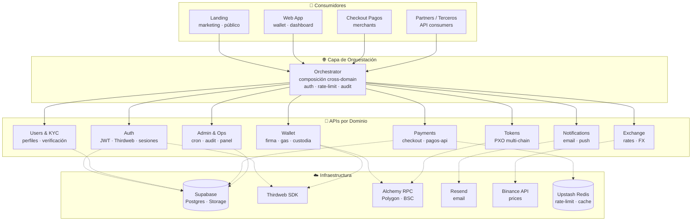
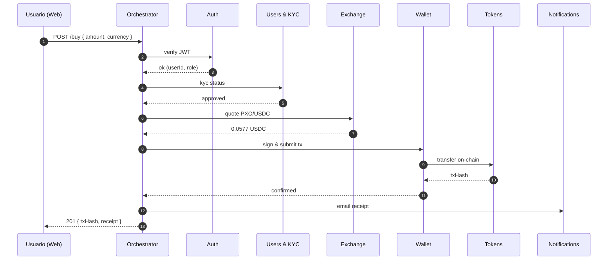

# Ecosistema PXO

Ecosistema del Peso Digital Mexicano (**PXO**). Monorepo que incluye las apps de usuario, el checkout de pagos, y las **APIs de dominio** que se ofrecen como producto a terceros.

> **Principios rectores**
> - **APIs por dominio** — cada dominio de negocio se publica como una API independiente, con ownership y ciclo de vida propios.
> - **Orquestación** — cuando un caso de uso combina varios dominios, la composición vive en una capa de orquestación explícita, nunca escondida dentro de un dominio.
> - **APIs como activo** — además de las apps de usuario, las APIs son un producto comercializable para partners y merchants.

---

## Arquitectura de alto nivel



**Flujo de lectura:** consumidor → orquestador → 1..N dominios → infraestructura. Cada dominio se puede versionar, escalar y vender de forma independiente; la orquestación es la que "conoce" el caso de uso de negocio.

---

## APIs por Dominio

| Dominio | Responsabilidad | Consumible como producto |
|---------|-----------------|--------------------------|
| **Auth** | Login con wallet (Thirdweb) · emisión/verificación JWT · sesiones | ✅ |
| **Users & KYC** | Perfil de usuario · estado y upgrades de KYC · webhooks de verificación | ✅ |
| **Wallet** | Firma de transacciones · custodia de private keys · subsidio de gas | 🟡 interno por ahora |
| **Payments** | Checkout · QR · cobros merchant · reconciliación | ✅ |
| **Exchange** | Cotización PXO/USDC/MXN · feeds de precio | ✅ |
| **Tokens** | Metadata y operaciones on-chain del PXO (Polygon · BSC) | ✅ |
| **Notifications** | Email transaccional (Resend) · push a futuro | 🟡 interno por ahora |
| **Admin & Ops** | Panel admin · cron · auditoría · rate-limit | ❌ privado |

---

## Orquestación — ejemplo: "Comprar PXO"

Caso de uso que toca **5 dominios**. La lógica de composición vive **sólo** en el orquestador; cada dominio hace una cosa.



---

## Estructura del monorepo

```
pxotoken/
├── apps/
│   ├── landing/       sitio público (Vite + React)
│   ├── web/           app principal — wallet, KYC, dashboard (Vite + React + Thirdweb)
│   ├── pagos/         checkout de pagos (Vite + React)
│   ├── pagos-api/     backend de pagos (Fastify · TS)
│   └── api/           API actual · handlers serverless (en migración a dominios)
├── packages/
│   ├── shared/        tipos, schemas, constantes
│   └── config/        configs base (TS, ESLint, Tailwind)
└── pnpm-workspace.yaml
```

**Dirección:** `apps/api` hoy concentra varios dominios como handlers serverless. La evolución es **separar** cada dominio en su propia unidad desplegable (estilo `pagos-api`, Fastify), y dejar el orquestador como capa independiente.

---

## Desarrollo local

```bash
pnpm install
pnpm dev                  # levanta web, landing, pagos, pagos-api
# api separado:
cd apps/api && ./node_modules/.bin/vercel dev --listen 3000
```

| App | URL |
|-----|-----|
| web | http://localhost:5173 |
| landing | http://localhost:5174 |
| pagos | http://localhost:5175 |
| pagos-api | http://localhost:3001 |
| api | http://localhost:3000 |

Variables de entorno: ver `.env.example` en cada app.
