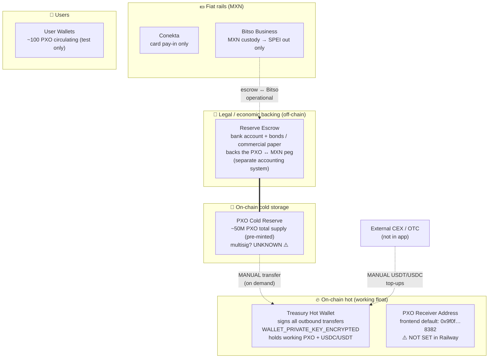
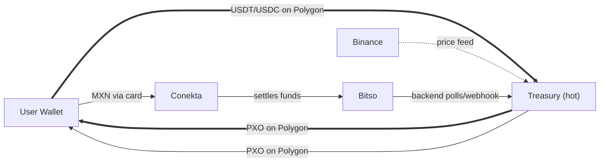
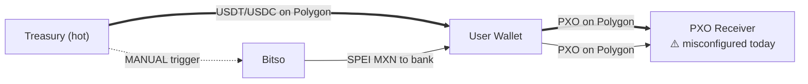
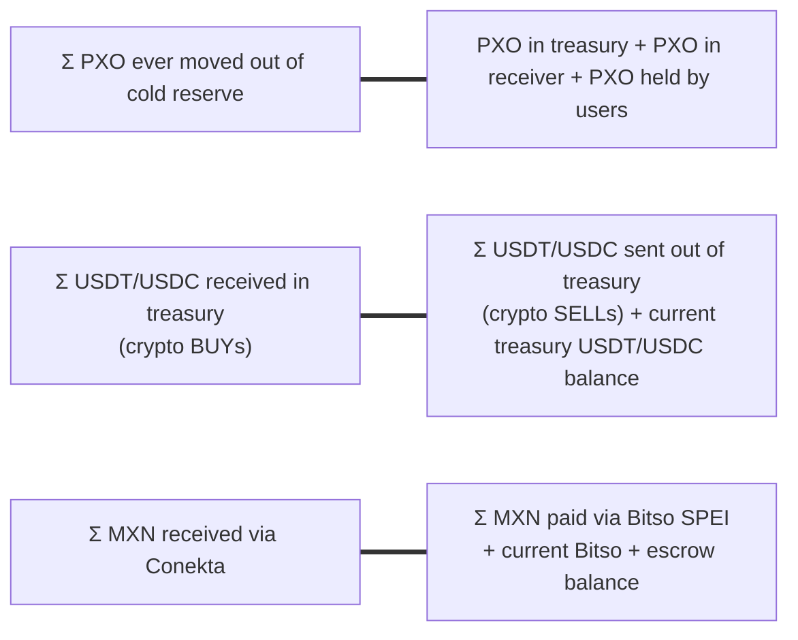

# Money Mechanics — PXO Ecosystem

**Audience:** CEO / executive stakeholders. Engineering reference also.
**Last updated:** 2026-06-25 (after Adrian's clarifications)

## How to view these diagrams

- **GitHub / IDE preview**: Mermaid renders inline.
- **Draw.io**: open Draw.io → *Extras → Edit Diagram → +* → choose **Mermaid** → paste a block.

---

## ⚠️ Active issues surfaced by this exercise

| # | Finding | Severity | Source |
|---|---|---|---|
| 1 | `POLYGON_PXO_RECEIVER_ADDRESS` is **not set** in Railway api-exchange. Backend rejects all mainnet SELL requests with HTTP 500. | **P0 — blocks any mainnet redemption** | `sell-pxo.ts:114` |
| 2 | ~~Frontend hardcoded fallback receiver `0x9f0f2eac…8382`.~~ **RESOLVED 2026-09-03.** The address is the backend's own server wallet — derived from `WALLET_PRIVATE_KEY` it matches the configured receiver exactly. No funds were ever out of reach, and the fallback was the correct address. The real defect was depending on a literal instead of configuration: a rotated wallet would have kept sending to the old one silently, since `VITE_*` bakes in at build time. Fallbacks removed; receiver now set explicitly. | ~~P0~~ — closed | `lib/pxoReceiver.ts`, SL-001 |
| 3 | Admin UI cannot see USDT in treasury (only PXO + USDC). | P1 | `WalletStatusPage.tsx`, `api-wallet/admin/status.ts` |
| 4 | No on-chain proof / dashboard tying the off-chain escrow to PXO supply. | P1 (audit/compliance) | n/a — gap |
| 5 | All refills (PXO reserve → treasury, USDT/USDC → treasury, MXN ↔ escrow) are manual and undocumented. | P2 — operational risk | Adrian, 2026-06-25 |
| 6 | PXO cold reserve multisig status unknown. | P2 — security risk | Adrian, 2026-06-25 |

---

## 1. Wallet topology — who's who

Layered view: what backs PXO, where the supply lives, what the working hot wallets do, and who the user is.

**Key relationships:**
- The **escrow** and the **cold reserve** are two backing rails for the same 50M PXO supply, but they're not currently linked by any automated process — they're separate accounting systems that must be manually reconciled.
- The **treasury hot wallet** is the only thing the running code knows about. Everything else is "human in the loop."
- The **PXO receiver address** misconfiguration is what makes Issue #1 a P0 — the backend can't validate inbound PXO sells without it.

---

## 2. BUY flows — user receives PXO

**Bold = crypto BUY:** USDT/USDC lands in treasury hot wallet. PXO is sent from the same treasury hot wallet.
**Light = fiat BUY:** MXN lands in Bitso. Treasury sends PXO. **No automated link from MXN-in to escrow accounting** — that reconciliation is manual.

---

## 3. SELL flows — user gives up PXO

**Bold = crypto SELL.** **Currently broken on mainnet** — backend rejects because receiver address env not set.
**Light = fiat SELL.** MXN comes from Bitso reserve; per existing scope, this leg is human-in-the-loop.

---

## 4. Static accounting — what should always balance

Three independent ledger lines. Each must reconcile, or you have a bug, an undocumented manual op, or a gap.

Today's admin UI shows the right-hand side of row 2 **partially** — PXO + USDC only, no USDT. No view of row 1 (cold reserve movements) or row 3 (fiat).

---

## 5. Today vs ideal future state

What you described as "ideal":

| Aspect | Today | Ideal (Adrian, 2026-06-25) |
|---|---|---|
| PXO supply | 50M pre-minted at genesis, sits in cold reserve | Mint on-demand when MXN deposits into escrow |
| Reserve → treasury refill | Manual on-demand | Programmatic when treasury PXO < threshold |
| Treasury USDT/USDC refill | Manual via CEX/OTC | Programmatic rebalancing |
| MXN ↔ escrow reconciliation | Manual, off-system | Tied to the on-chain ledger |
| Admin visibility | PXO + USDC only | All assets across all wallets + escrow |
| SELL receiver address | Misconfigured / orphaned | Treasury (or known cold address) explicitly configured |

The gap between today and ideal is roughly 3-6 months of work depending on team size and how much you want to automate. **For the soft launch, the priority is not closing this gap — it's making the manual processes work reliably and visible to one auditor.**

---

## 6. Confirmed facts (verified with Adrian 2026-06-25)

1. `POLYGON_PXO_RECEIVER_ADDRESS` is not set in any Railway environment. **Confirmed broken SELL flow on mainnet.**
2. PXO real reserve lives in a **cold wallet**. Multisig status: **unknown**.
3. Reserve → treasury refill: **manual / on-demand manual**.
4. Treasury USDT/USDC refill: **manually sent**.
5. Bitso MXN is **redemption-out only**. There's a **separate reserve escrow** (bank account + bonds/commercial paper) that backs the PXO ↔ MXN peg. Ideal future: mint-on-deposit (not implemented).
6. Total supply: **50M PXO**, all held in cold reserve. **~100 PXO circulating** among investors for testing purposes.

---

## 7. Still open (for follow-up)

1. Identity and provenance of `0x9f0f…8382` — whose wallet, any orphaned PXO sitting there?
2. Cold reserve wallet address (for inclusion in admin views and audit docs).
3. Cold reserve multisig configuration (single sig? gnosis safe? thresholds?).
4. Escrow → cold reserve relationship: who has signing authority to move PXO out of cold reserve when escrow MXN arrives?
5. Insurance / bonding on the reserve escrow assets — what's the legal claim mechanism if PXO is over-issued vs escrow balance?
